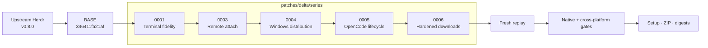

# herdr-win

**A native Windows distribution of [Herdr](https://github.com/ogulcancelik/herdr), maintained as a small, reviewable patch queue—not a permanent fork.**

[](https://github.com/hdosys/herdr-win/actions/workflows/ci.yml) [](https://github.com/hdosys/herdr-win/actions/workflows/release.yml) [](https://github.com/hdosys/herdr-win/blob/master/rust-toolchain.toml) [](https://github.com/hdosys/herdr-sandbox) [](https://github.com/hdosys/herdr-win/blob/master/LICENSE)

`herdr-win` is an unofficial, upstream-first delivery lane for Herdr on Windows. It keeps the normal `herdr` command and workflow, adds Windows behavior that has not yet landed upstream, and publishes tested snapshots from an exact reviewed Herdr release plus four explicit patches.

[Why it exists](#why-it-exists) · [What it adds](#what-differs-from-upstream) · [Install](#install) · [Patch flow](#how-the-patch-queue-works) · [Upstream review](#for-upstream-maintainers) · [Maintaining](#maintaining-the-project) · [Herdr Sandbox](#sister-project-herdr-sandbox)

> [!NOTE]
> Upstream Herdr owns the general CLI, configuration, integrations, and product documentation. This repository owns only its Windows-focused delta and distribution. Reproduce general issues with upstream Herdr before reporting them here.

## Why it exists

Herdr already runs on Windows, but a good Windows release needs more than a binary that compiles. Terminal fidelity, remote attachment, safe packaging, updates, and native verification all need clear ownership.

This repository provides that focused delivery path:

- **Useful Windows behavior now:** fixes can ship without turning the fork into a separate product.
- **A visible delta:** every retained change belongs to one reviewable mailbox instead of disappearing into branch history.
- **An upstream route:** code that lands upstream is removed from the queue rather than maintained twice.
- **Reproducible snapshots:** source, patch order, build identity, artifacts, and SHA-256 digests stay connected.

## What differs from upstream

The table is intentionally capability-level. The patch files contain the exact implementation and tests.

| Area | Status | What this repository contributes |
| --- | --- | --- |
| Native ConPTY foundation | ✅ **Upstreamed in Herdr v0.6.9** | Herdr v0.8.0 added the modern app-local ConPTY packaging that herdr-win now reuses instead of carrying a duplicate foundation. |
| Terminal fidelity | **Maintained here** · [`0001`](https://github.com/hdosys/herdr-win/blob/master/patches/delta/0001-windows-terminal-appearance.patch) | Windows appearance, color and cursor fidelity, rendering, and VTI input behavior. |
| Windows remote attach and image bridge | **Maintained here** · [`0003`](https://github.com/hdosys/herdr-win/blob/master/patches/delta/0003-windows-remote-attach.patch) | Windows SSH and named-pipe attachment, shared remote orchestration, and bounded clipboard/drop image transport. |
| Managed Windows snapshots | **Maintained here** · [`0004`](https://github.com/hdosys/herdr-win/blob/master/patches/delta/0004-windows-managed-distribution.patch) | Verified Windows packages, per-user setup, portable archives, package-manager update ownership, and safe runtime handoff. |
| OpenCode lifecycle reporting | **Maintained here** · [`0005`](https://github.com/hdosys/herdr-win/blob/master/patches/delta/0005-opencode-retry-notifications.patch) | Retry-aware status correlation so active retries stay quiet and terminal failures remain visible. |
| Runtime downloads | **Maintained here** · [`0006`](https://github.com/hdosys/herdr-win/blob/master/patches/delta/0006-harden-curl-transfers.patch) | Cross-platform `curl` transfers ignore user configuration and permit only bounded TLS 1.2+ HTTPS requests and redirects. |

The Windows remote/image bridge builds on [nsxdavid's `feat/windows-remote-attach` work](https://github.com/nsxdavid/herdr/tree/feat/windows-remote-attach). The maintained mailbox adapts and extends that foundation within this queue.

## Sister project: Herdr Sandbox

herdr-win is developed and validated with [**Herdr Sandbox**](https://github.com/hdosys/herdr-sandbox), a disposable native Windows development environment for coding agents. It provides the clean Windows toolchains and realistic native boundary used to build and test this fork; it is a sister project, not a runtime dependency.

## How the patch queue works



[`patches/delta/BASE`](https://github.com/hdosys/herdr-win/blob/master/patches/delta/BASE) records the exact upstream stable commit. [`series`](https://github.com/hdosys/herdr-win/blob/master/patches/delta/series) is the only application order. Each patch is a full-index, binary-safe mailbox with one logical responsibility.

An upstream refresh is deliberate: select the latest stable release, replay the complete queue, remove behavior upstream now owns, regenerate changed mailboxes, and verify a fresh replay. `BASE` never follows upstream `master` automatically.

## Install

Windows x86_64 is the managed distribution target. Each release also carries matching Linux and macOS binaries for remote endpoints that must speak the same wire protocol.

### Setup (recommended)

<p align="center">
  
</p>

Download the newest `herdr-win_v<version>_windows_amd64_setup.exe` from [Releases](https://github.com/hdosys/herdr-win/releases) and run it. Setup installs for the current user without administrator access, adds `herdr` to the user `PATH`, and registers an uninstaller. Open a new terminal and run:

```powershell
herdr
```

For setup downloaded directly from Releases, use `herdr update` from an ordinary terminal after detaching from active Herdr sessions. Updates preserve running sessions and activate the new verified snapshot when it is safe. A WinGet-owned installation instead updates through:

```powershell
winget upgrade --id hdosys.herdr-win --exact --source winget
```

GitHub may publish a snapshot before the WinGet catalog finishes accepting it. A WinGet-owned copy shows an update only after the official `winget` source contains that exact release version, so its update action always points to installable bytes.

Uninstall from **Windows Settings → Apps → Installed apps**; settings are preserved unless you explicitly choose to remove them. Locked or unsafe settings and skill residue is preserved and reported without blocking removal of the program, registration, or its installer-owned `PATH` entry. Stale private installer staging is never a reason to strand install, update, or uninstall. Uninstall stops safely if the install root is unowned or uses an unsupported legacy layout, a type or reparse-point boundary is unsafe, a managed process is active, a runtime lease is active or ambiguous, or another setup, uninstall, or launcher owns the relevant lock.

### Verify the download

GitHub records a SHA-256 digest for every immutable release asset. Before running setup, verify the downloaded file against the `digest` for the same filename in that tagged release's GitHub metadata.

### Portable Windows ZIP

The release also includes `herdr-win_v<version>_windows_amd64.zip`. Extract the complete archive into one directory and run `herdr.exe`.

> [!WARNING]
> The Herdr executable and setup are currently unsigned, so Windows may show a SmartScreen warning. Download release artifacts only from this repository.

### Matching Linux and macOS binaries

Each release includes raw `linux_amd64`, `linux_arm64`, `macos_amd64`, and `macos_arm64` executables. They are compatibility companions for remote hosts, not managed installers.

herdr-win currently uses wire protocol 20. A remote client and server must agree on that protocol, so an official Herdr build with a different protocol is not interchangeable. Use matching binaries from the same herdr-win release on every endpoint.

For general commands, configuration, and agent integrations, use the [official Herdr documentation](https://herdr.dev/docs/).

## For upstream maintainers

The five files in `patches/delta/series` are the complete maintained product delta. You do not need to infer behavior from this fork's development history.

1. Start at the exact commit in [`BASE`](https://github.com/hdosys/herdr-win/blob/master/patches/delta/BASE).
2. Apply [`series`](https://github.com/hdosys/herdr-win/blob/master/patches/delta/series) in order with `git am --3way`.
3. Review each mailbox as one responsibility-oriented change with its implementation, tests, and documentation.
4. Follow [`CONTRIBUTING.md`](https://github.com/hdosys/herdr-win/blob/master/CONTRIBUTING.md) to reproduce the replay and verification gates.

The mailboxes are review units, not a request to merge each one unchanged. Generic parts can be split along upstream ownership boundaries. Fork branding, release workflows, and publication state stay outside the product queue.

## Maintaining the project

Refresh and release are intentionally separate manual operations:

- **Refresh:** select and review a stable upstream release, then replay and minimize the queue.
- **Build:** replay recorded `BASE`, run the complete gates, and retain one candidate with provenance and checksums.
- **Promote:** publish those exact retained bytes without rebuilding or repackaging them.

Ordinary pushes do not publish binaries.

| Need | Canonical owner |
| --- | --- |
| User-visible fork behavior | [`PRODUCT.md`](https://github.com/hdosys/herdr-win/blob/master/PRODUCT.md) |
| Technical boundaries | [`ARCHITECTURE.md`](https://github.com/hdosys/herdr-win/blob/master/ARCHITECTURE.md) |
| Patch ownership and refresh policy | [`patches/delta/README.md`](https://github.com/hdosys/herdr-win/blob/master/patches/delta/README.md) |
| Replay, verification, and release procedure | [`CONTRIBUTING.md`](https://github.com/hdosys/herdr-win/blob/master/CONTRIBUTING.md) |
| Open work | [`BACKLOG.md`](https://github.com/hdosys/herdr-win/blob/master/BACKLOG.md) |

## Issues and contributions

- Use [upstream Herdr](https://github.com/ogulcancelik/herdr) for general product behavior that reproduces with an official upstream build.
- Use [herdr-win issues](https://github.com/hdosys/herdr-win/issues) for this distribution's artifacts, update feed, workflows, or maintained patches.
- Read [`CONTRIBUTING.md`](https://github.com/hdosys/herdr-win/blob/master/CONTRIBUTING.md) before changing the queue or release automation.

## Credits and license

Herdr is created and maintained upstream by [Can Çelik](https://github.com/ogulcancelik). herdr-win is distributed under the [Apache License 2.0](https://github.com/hdosys/herdr-win/blob/master/LICENSE).
